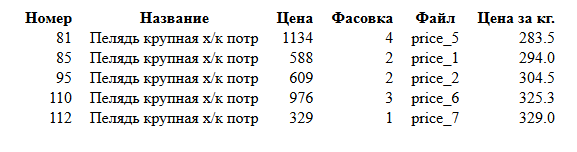

## Python стажировка
## Практическая работа для отбора на стажировку
## Практическое задание "Анализатор прайс-листов."

### Задача: Написать анализатор прайс-листов.


### 1. Программа должна загрузить данные из всех прайс-листов
Пример входных данных: содержимое файла в формате .csv:
```
,,продукт,цена,цена опт,масса
,,Брюшки лосося ,702,610,2
,,Горбуша б/г ,2239,1903,4
,,Горбуша н/р ,740,643,2
,,Горбуша х\к теша в\у,3422,2977,4
,,Густера,4624,4069,4
,,Зубатка пестрая б/г ,1867,1624,2
,,Камбала н/р б/б ,688,598,1
```

### 2. Интерфейс программы для поиска товара по фрагменту названия (с сорторовкой по цене за килогорамм) реализован через консоль, циклически получая информацию от пользователя.

Вид консоли при работе программы: 
```
Команда - "all" - позволит получить полный список позиций в виде таблицы
Команда - "exit" - завершить работу программы
Для вывода данных по продукту - 

Введите наименование продукта: Пелядь крупная х/к потр
       №             Наименование  Цена Вес Цена за кг.     Файл
80    81  Пелядь крупная х/к потр  1134   4       283.5  price_5
84    85  Пелядь крупная х/к потр   588   2       294.0  price_1
94    95  Пелядь крупная х/к потр   609   2       304.5  price_2
109  110  Пелядь крупная х/к потр   976   3  325.333333  price_6
111  112  Пелядь крупная х/к потр   329   1       329.0  price_7

Введите наименование продукта: 
```

### 3. Результат работы программы выводиться в HTML файл: output.html
Пример выводимой HTML страницы:

 
 
### Использовалось:

- PYTHON версии 3.10.6
- numpy==2.1.1
- pandas==2.2.2
- python-dateutil==2.9.0.post0
- pytz==2024.1
- six==1.16.0
- tzdata==2024.1P


### Задание выполнено с применением:

Pandas — это библиотека на языке Python для обработки и анализа данных. Она предоставляет специальные структуры данных и операции для манипулирования числовыми таблицами и временными рядами.

Исходный текст задания находиться в файле: "Текст задания.txt"